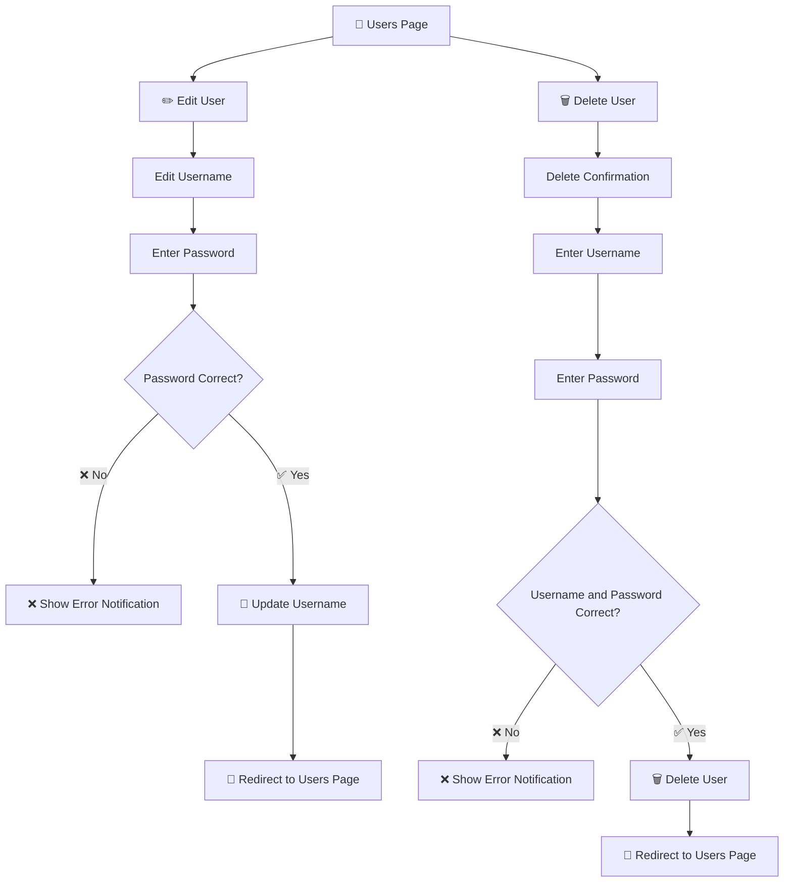

# 👤 User Management System

A simple and interactive **User Management System** built using **Node.js, Express.js, EJS, and MySQL**.

This project demonstrates how a backend application can connect to a MySQL database and perform basic user management operations through a web interface.

## 🚀 Features

- 🏠 Home dashboard
- 👥 Display total number of users
- 📋 View all users
- ✏️ Edit username
- 🔐 Password verification before editing
- 🔐 Username and password verification before deleting
- 🗑️ Delete user information from MySQL
- 💾 Update user information in MySQL
- 🔄 Method Override for PATCH requests
- 🎨 Responsive and interactive UI
- 📱 Mobile-friendly design
- 🗄️ MySQL database integration
- ⚡ Express.js backend
- 🖥️ EJS dynamic templates

## 🛠️ Technologies Used

| Technology      | Purpose                            |
| --------------- | ---------------------------------- |
| Node.js         | JavaScript runtime                 |
| Express.js      | Backend framework                  |
| EJS             | Dynamic HTML templates             |
| MySQL           | Database                           |
| mysql2          | MySQL connection                   |
| Faker.js        | Generate sample users              |
| Method-Override | Use PATCH requests from HTML forms |
| HTML            | Page structure                     |
| CSS             | User interface                     |
| Git & GitHub    | Version control                    |

## 📂 Project Structure

```text
SQL/
│
├── index.js
├── package.json
├── package-lock.json
├── .gitignore
├── README.md
│
├── public/
│   └── style.css
│
└── views/
    ├── home.ejs
    ├── users.ejs
    ├── edit.ejs
    ├── delete.ejs
    └── message.ejs
```

## ⚙️ Installation

### 1. Clone the repository

```bash
git clone https://github.com/priyankajadhav7057/User-Management-System.git
```

### 2. Go into the project folder

```bash
cd User-Management-System
```

### 3. Install dependencies

```bash
npm install
```

### 4. Create the MySQL database

Open MySQL and create the database:

```sql
CREATE DATABASE MY_APP;
```

Select the database:

```sql
USE MY_APP;
```

Create the users table:

```sql
CREATE TABLE user (
    id VARCHAR(255) PRIMARY KEY,
    username VARCHAR(100),
    email VARCHAR(255),
    password VARCHAR(255)
);
```

## 🔧 Database Configuration

The application connects to MySQL using:

```js
const connection = mysql.createConnection({
  host: "localhost",
  user: "root",
  database: "MY_APP",
  password: "root",
});
```

Update these values according to your local MySQL configuration.

> ⚠️ **Note:** For production applications, database credentials should be stored in environment variables instead of directly inside `index.js`.

## ▶️ Run the Project

Start the application using:

```bash
node index.js
```

Or, if you have Nodemon installed:

```bash
nodemon index.js
```

The application will run at:

```text
http://localhost:8080
```

## 🌐 Application Pages

### 🏠 Home

```text
http://localhost:8080/
```

Displays the total number of registered users.

### 👥 Users

```text
http://localhost:8080/user
```

Displays all users stored in the MySQL database.

### ✏️ Edit User

```text
http://localhost:8080/user/:id/edit
```

Allows a user to update their username after password verification.

### 🗑️ Delete User

```text
http://localhost:8080/user/:id/delete
```

Allows a user to delete their account after username and password verification.

## 🔄 User Management Flow

The following flow shows how the **Edit** and **Delete** operations work in the application:



### 🔁 Overall Application Flow

```text
                    👥 USERS PAGE
                         │
              ┌──────────┴──────────┐
              ↓                     ↓
          ✏️ Edit User          🗑️ Delete User
              │                     │
              ↓                     ↓
       Edit Username        Delete Confirmation
              │                     │
              ↓                     ↓
       Enter Password        Enter Username
              │                     │
              ↓                     ↓
      Password Correct?      Enter Password
          │       │                 │
        ❌ No    ✅ Yes             ↓
          │       │        Username & Password
          ↓       ↓             Correct?
      ❌ Error   💾 Update        │      │
                  Username       ❌ No   ✅ Yes
                    │              │      │
                    ↓              ↓      ↓
             👥 Users Page      ❌ Error  🗑️ Delete
                                          │
                                          ↓
                                   👥 Users Page
```

## 🔄 CRUD Concepts Demonstrated

This project mainly demonstrates database and REST concepts.

| Operation     | HTTP Method | Example          |
| ------------- | ----------- | ---------------- |
| Read users    | GET         | `/user`          |
| Read one user | GET         | `/user/:id/edit` |
| Update user   | PATCH       | `/user/:id`      |
| Delete user   | DELETE      | `/user/:id`      |

The project follows this basic flow:

```text
Express Route
      ↓
MySQL Query
      ↓
Database
      ↓
EJS Template
      ↓
HTML UI
```

## 🔐 Password Verification

Before updating the username, the application checks whether the entered password matches the password stored for that user.

```js
if (formPass !== user.password) {
  return res.send("Password is incorrect");
}
```

If the password is correct, the username is updated.

For deleting a user, the application verifies both the **username** and **password** before deleting the record.

> ⚠️ This project is for learning purposes. In a real-world application, passwords should be securely hashed using a library such as `bcrypt`.

## 🎨 UI

The project includes a responsive interface with:

- 🏠 Dashboard
- 📊 User statistics
- 👥 User table
- ✏️ Edit user form
- 🗑️ Delete user form
- 🧭 Navigation bar
- ✨ Hover effects
- 📱 Responsive layout
- 🎨 Modern cards and buttons

## 📸 Screenshots

Add screenshots of your project here after running it locally.

Example folder:

```text
screenshots/
├── home.png
├── users.png
├── edit-user.png
└── delete-user.png
```

Then add them to this README:

```markdown


```

## 🎯 Learning Objectives

This project helped me understand:

- Node.js
- Express.js
- EJS
- MySQL
- SQL queries
- Express routing
- REST concepts
- GET, PATCH, and DELETE requests
- CRUD operations
- Method Override
- Form handling
- Database connection
- Dynamic EJS rendering
- Git and GitHub

## 🔮 Future Improvements

Some features that can be added in the future:

- ➕ Add new users
- 🔍 Search users
- 📄 Pagination
- 🔐 Password hashing with bcrypt
- 🔑 User authentication
- 🍪 Sessions and cookies
- 🌙 Dark mode
- 📊 User analytics dashboard
- 🔒 Environment variables using `.env`

## 👩‍💻 Author

**Priyanka Gaikwad**

This project was created as a learning project to practice **Node.js, Express.js, EJS, MySQL, REST concepts, CRUD operations, and GitHub**.

## ⭐ If you like this project

If you find this project useful for learning, consider giving the repository a ⭐ on GitHub.
